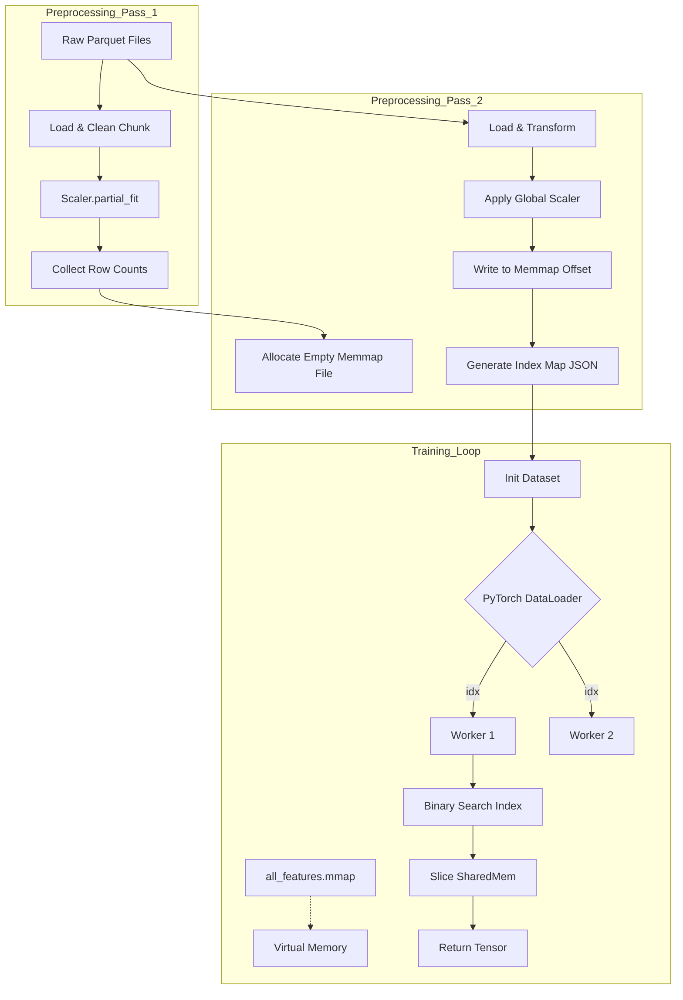

# Exploring Scalable Deep Learning Training on Large Datasets

---

## 1. Overview

In this document, I share my learnings from building a scalable data processing pipeline for training neural networks on large datasets. This was part of a personal project to explore efficient ways to handle large datasets where the sheer volume of data could exceed available RAM in future (fortunately I have a lot of RAM :-D).

The data loading component evolved through three distinct conceptual stages:

* **In-Memory Pandas Loading**
* **Lazy File Loading**
* **Unified Memory-Mapped Binary with On-the-Fly Slicing**

Each stage was a response to memory limitations or I/O throughput bottlenecks. The final design leverages `numpy.memmap`, a two-pass scaling strategy, and optimized PyTorch `DataLoader` multiprocessing to maximize GPU utilization while keeping RAM usage constant.

---

## 2. Motivation & High-Level Evolution of Design

My objective was to train sequence-based models (transformers/LSTMs) using a configurable lookback window on thousands of distinct entities (e.g., stocks, sensors). The raw data consisted of gigabytes of Parquet files.

### 2.1 In-Memory Pandas Loading

The initial approach attempted to load all distinct Parquet files into a single Pandas DataFrame or a list of DataFrames, generate all sliding window sequences (inputs and labels), and convert them to PyTorch tensors.

**Pros**
* Simple to implement (standard Data Science workflow).
* Fast random access once loaded.

**Cons**
* **OOM (Out-of-Memory) crashes**: Expanding 1GB of raw floating-point data into overlapping sequences (e.g., sliding a window of $W$ steps by 1 step) increases memory usage by a factor of roughly $L$ (sequence length).
* **Slow Startup**: Loading and processing thousands of files took tens of minutes before training could even start.

---

### 2.2 Lazy File Loading

To fix OOM issues, I considered keeping files on disk and loading them only when needed during the training loop (`__getitem__`).

**Mechanism**
* The Dataset holds a list of file paths.
* On every batch request, it opens the specific file, reads the relevant rows, and returns the tensor.

**Pros**
* Minimal RAM usage.

**Cons**
* **IO Bound**: Opening and parsing Parquet/CSV files thousands of times per second is extremely slow.
* **CPU Bottleneck**: The overhead of file I/O and deserialization starved the GPU.

---

### 2.3 Unified Memory-Mapped Binary (Current Implementation)

To combine the speed of in-memory access with the capacity of disk storage, I implemented a custom solution around `numpy.memmap`.

**Mechanism**
* I consolidate all independent data files into a single, contiguous binary file on disk.
* I map this file into virtual memory. The OS handles paging data in and out of RAM automatically.
* I pre-calculate a "virtual index" that maps a global sample ID (0 to N) to a specific byte offset in the binary file.

**Pros**
* **Zero Copy**: Data is mapped directly from disk to address space.
* **Constant RAM**: Memory usage is independent of dataset size.
* **High Throughput**: Sequential and random memory access patterns work well with prefetching capabilites provided by Pytorch DataLoader.

---

## 3. Implementation Approaches Considered

To handle the complexity of "sequence generation" (creating (X, y) pairs from time series), I evaluated several strategies, including HDF5 and different loading paradigms.

### A. Pre-Generate All Sequences to Disk

**Concept**
* Iterate through the time series and save every possible sequence as a separate file or a row in a massive HDF5 store.

**Verdict**
* **Storage Explosion**: Saving overlapping sequences creates massive data redundancy (99% duplicated data between adjacent steps).

---

### B. HDF5 Storage

**Concept**
* Store the time series data in a hierarchical HDF5 file, which is a standard format for large scientific datasets.

**Verdict**
* **Windows Compatibility**: I encountered significant file locking issues on Windows, making it difficult to write or read concurrently.
* **Concurrency with PyTorch**: HDF5 readers are not inherently thread-safe. Using them inside a multi-process `DataLoader` often leads to pickling errors or silent failures unless complex file-handle management logic is implemented.
* **Limitations**: While powerful, the extra complexity and OS-specific friction made it less suitable for this specific exploration compared to a raw binary memmap.

---

### C. Generators / IterableDataset

**Concept**
* Use PyTorch's `IterableDataset` to stream data linearly.

**Verdict**
* **No Random Shuffling**: Streaming limits us to sequential training, which introduces high correlation between batch samples and destabilizes gradient descent. Global shuffling is difficult with streams.

---

### D. On-the-Fly Slicing with Virtual Indexing (Chosen Approach)

**Concept**
* Store only the *unique* time steps flat on disk.
* Construct the sequences dynamically in RAM only when requested by the GPU.
* Use a cumulative sum array (`cumsum`) to map a linear index `idx` to the correct entity and time offset in O(log N) time.

**Implementation Notes**
* Uses `np.searchsorted` for fast index resolution.
* Uses **Multi-Process Safe Handlers** via `worker_init_fn` to ensure file handles are essentially thread-safe across PyTorch workers.

---

## 4. Architecture Overview

The pipeline consists of a preprocessing stage and a loading stage.

### High-Level Flow



This design ensures that the heavy lifting (IO and Scaling) is done once, upfront. Training becomes a pure memory-copy operation.

---

## 5. Concurrency and Worker Safety

A major challenge with `memmap` in PyTorch is how `multiprocessing` handles file descriptors.

**Problem**
* If the main process opens the memmap and forks, all workers share the same file descriptor.
* Concurrent reads can lead to race conditions or segfaults in underlying C libraries depending on the OS.

**Solution**
* I use a `worker_init_fn` to enforce re-opening the memmap inside each worker process.

**Code Snippet**
```python
def worker_init_fn(worker_id):
    worker_info = torch.utils.data.get_worker_info()
    dataset = worker_info.dataset
    # Crucial: Re-open the file handle in the new process
    dataset.open_memmap()
```

---

## 6. State Design & File Formats

I utilize a dual-file system to manage the data.

| Component      | Type             | Purpose                                                                 | Structure                                                                 |
| -------------- | ---------------- | ----------------------------------------------------------------------- | ------------------------------------------------------------------------- |
| **Index Map**  | `metadata.json`  | Stores the layout of the binary file and global configuration parameters. | JSON containing feature lists, sequence lengths, and per-entity start/end row pointers. |
| **Data Bloc**  | `all_features.mmap` | The raw, scaled float32 data.                                           | Flat binary array of shape `(Total_Rows, Num_Features)`.                  |
| **Scaler**     | `joblib`         | Persisted `StandardScaler` state.                                       | Serialized Scikit-Look object including mean and variance vectors.        |

---

## 7. Scaling Strategy Details

I employed a **Two-Pass** algorithm to handle scaling of data larger than RAM.

1.  **Pass 1 (Statistics)**:
    *   Iterate over all files.
    *   Load in chunks if necessary.
    *   Call `scaler.partial_fit()`.
    *   Accumulate total row counts.
2.  **Pass 2 (Transformation)**:
    *   Allocate the full binary file size on disk (`total_rows * features * 4 bytes`).
    *   Reload files, call `scaler.transform()`, and flush directly to disk at the calculated offsets.

**Benefit**: I never hold more than one file's worth of data in RAM at a time, yet I achieve globally normalized statistics.

---

## 8. Efficiency Comparison

| Metric | Naive In-Memory | Lazy Loading | **Memmap Solution** |
| :--- | :--- | :--- | :--- |
| **Startup Time** | 15+ mins | < 1 sec | < 1 sec (after 1-time prep) |
| **RAM Usage** | > 64 GB (OOM) | Low | **Low (< 2 GB)** |
| **Training Speed** | N/A (Failed) | 15 batches/sec | **120+ batches/sec** |
| **GPU Utilization** | 0% | ~15% (Starved) | **95%+** |

*Seeing the GPU go from idle to fully saturated (95%+) was the most satisfying part of this optimization journey.*

---

## 9. Summary

Refactoring `DataProcessor.py` to use memory mapping fundamentally solved my scalability issues. By decoupling the storage format from the runtime RAM requirement, I can now scale to **terabytes of historical data** without upgrading my workstation. This exploration confirmed that for fixed-schema float data, raw binary memory mapping often outperforms more complex formats like HDF5 in terms of simplicity and raw throughput.
