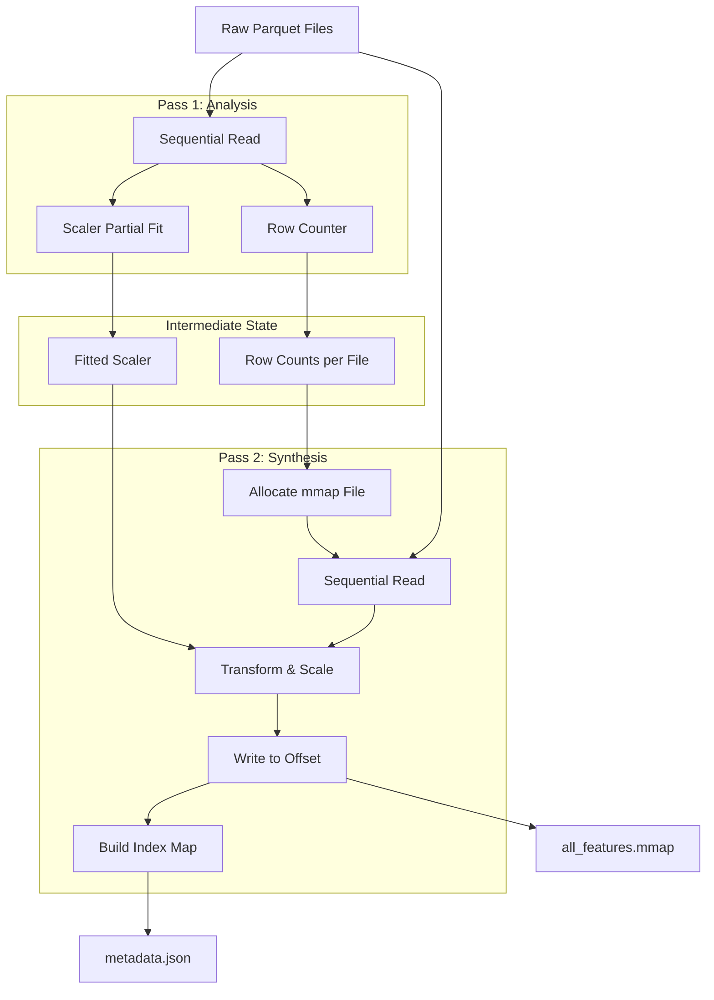

# Exploring Scalable Deep Learning Training on Large Datasets


We often obsess over transformer architectures and optimizer states, but if you can't feed the GPU fast enough, those TFLOPS are wasted. I recently anticipated running into this wall while training sequence models as sources and volume of financial data increased. My dataset wasn't "Google scale", but it was large enough (GBs of raw float data) to crash a standard dev box and choke a naive disk loader but luckily I also had enough RAM to settle with relatively easier but still not optimal solution at the time when I first encountered it but could foresee that it was not the best way to go as data would increase.

This document details the transition from a convenient but fragile "load everything in RAM" approach to a robust, OS-native memory mapping strategy.

---

## 1. The Naive Approach: "Just Load It"
The standard data science workflow is seductive in its simplicity:
1. `pd.read_parquet(files)`
2. `Tensor(df.values)`
3. Train.

**The Failure Mode:**
This works for MNIST. It fails for huge datasets.
Python objects have massive memory overhead. Even using NumPy, creating sliding windows (sequences) for a transformer or LSTM usually implies duplicating data. If you have a time series of length $N$ and a window size $W$, a naive stride expansion explodes memory usage by a factor of $W$.

We will hit the OOM (Out of Memory) killer almost immediately.

---

## 2. The Trap: Lazy File Loading
One of the most obvious fixes is "Lazy Loading": don't load the file until `__getitem__` asks for it.
*   **Mechanism**: Store file paths. On every step, open the file, seek, read, close.
*   **The Reality**: This creates a syscall storm.

Modern NVMe drives are fast but not that fast, and `open()` and `read()` are system calls. They incur context switches. Doing this thousands of times per second (batch_size * workers) saturates the CPU kernel time. My GPU utilization sat very low because it spent most of its time waiting for the CPU to finish parsing CSVs/Parquets.

**The Lesson**: Minimizing IO latency is not enough; we must minimize *IO Frequency*.

---


## 3. HDF5
Naturally, one looks to standard scientific formats like HDF5 (`.h5`). It's designed exactly for this, right?

**The Reality**: HDF5 is fantastic for archival, but painful for high-throughput concurrent deep learning, especially on Windows.

1.  **The Global Interpreter Lock (GIL) of Data**: Standard HDF5 libraries often have internal locks. When you try to read from multiple threads, they often serialize the access, killing your parallelism.
2.  **The Windows "Spawn" Problem**: On Linux, `fork()` is cheap and Copy-on-Write allows easy handle sharing. Windows uses `spawn()`. Every worker process is a fresh interpreter. Passing an HDF5 file handle from the main process to a worker is not feasible as it's not picklable. This forces every worker to `open()` the file independently.


I needed raw throughput, not hierarchical organization. The complexity-to-benefit ratio of getting HDF5 to work reliably with PyTorch `DataLoader` on Windows was simply too high.

---

## 4. The Solution: Leveraging the OS Page Cache (`mmap`)
The correct solution is to stop fighting the OS and let it do what it was designed to do: manage memory.

**Memory Mapped Files (`mmap`)** allow us to map a file on disk directly into the virtual address space of the process.
*   **Zero-Copy**: We don't read data from disk into a kernel buffer and then copy it to user space. The file *is* the memory.
*   **Demand Paging**: The OS loads pages (typically 4KB chunks) only when we fault (access) them.
*   **Eviction**: If RAM gets tight, the OS silently drops clean pages. We don't crash; we just slow down slightly (thrashing), but the pipeline stays alive.

### The Architecture: A "Flat Binary"
To make this work, we can't use complex formats like HDF5 (concurrency issues) or Parquet (compression overhead on read). We need raw, contiguous bytes.

I implemented a **Two-Pass Preprocessing Pipeline**:

#### Pass 1: Global Statistics (The Scan)
We need to normalize inputs, but we can't load the whole dataset to compute `mean` and `std`.
*   Solution: `StandardScaler.partial_fit()`.
*   We stream through the raw files, computing running statistics and counting total rows.
*   *Result*: A global scaler and an exact byte-count for the final file.

#### Pass 2: The "Linker" (The Write)
We allocate a massive sparse file on disk (`all_features.mmap`) using `seek` and `write`.
Then, we reload the raw data, apply the scaler, and blast the `float32` arrays directly into the specific offsets of the memmap.

We also generate a `metadata.json`. This acts as our "FAT table," mapping a high-level `(Stock_Symbol)` to a low-level `(Start_Byte, End_Byte)`.



---

## 5. The Concurrency "Gotcha" (Fork Safety)
This is where things get technical. PyTorch's `DataLoader` uses `multiprocessing`. On Linux, this uses `fork()`.

**The Problem**:
When you `fork()`, the child process inherits the parent's file descriptors. If you open the memmap in the main process, all workers share the *same* file descriptor and, critically, the same *seek pointer*.
If Worker A reads, it moves the pointer. Worker B tries to read, and it's reading from the wrong place. Or commonly, segfaults occur inside the C-level lib.

**The Fix**:
We must force a re-open of the file handle *after* the fork.

```python
def worker_init_fn(worker_id):
    # This runs inside the new process
    dataset = torch.utils.data.get_worker_info().dataset
    # Crucial: Get a fresh file descriptor for this process
    dataset.open_memmap()
```

This ensures every worker has its own private interface to the underlying memory pages.

---

## 6. Efficient Indexing: `O(log N)` Resolution
We have a unified binary blob, but our samples are distinct sequences.
How do we map global index `i` (0 to 1,000,000) to a specific sequence for "Apple Inc."?

I used a `cumulative_sum` array of sequence counts.
*   Let `cumulative_sequences` be `[100, 350, 420...]`.
*   Global index `300` falls between `100` and `350`.
*   We find this bin using `np.searchsorted` (Binary Search).
*   Operation is `O(log K)` where K is the number of stock symbols. Extremely fast.

---

## 7. Results & Conclusion

The difference is night and day.

*   **Startup Time**: Near instant. We just map pointers.
*   **RAM Usage**: Flat. I can train on 1TB of data with 16GB of RAM. The OS manages the working set.
*   **GPU Utilization**: Saturation. The `DataLoader` is no longer the bottleneck.

By moving to a raw binary format, we stripped away the abstraction layers (Pandas, Parquet, Object overhead) and got closer to the metal. For deep learning on single node , **`mmap` is all you need.**
