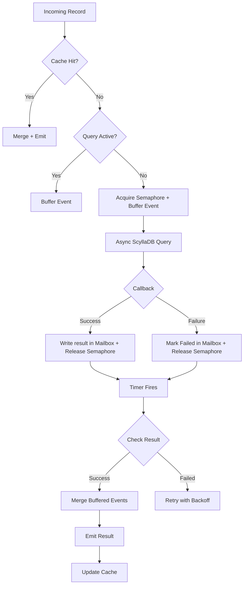

# Scaling Beyond Async I/O: Achieving High Throughput Per-Key Consistency in Flink Enrichment

## Overview

This post details my work on evolving our Flink enrichment pipeline to handle massive data volumes while maintaining strong consistency. Our component performs a classic read-modify-write: fetch state from Database, merge with an incoming event, and write back.

We went through three distinct stages: a simple synchronous operator (too slow), a pure async implementation (fast but inconsistent), and finally a custom stateful operator that balances both.

---

## Synchronous Processing

Our initial proof-of-concept was simple: a global operator that synchronously read from ScyllaDB, enriched the record, and wrote it back.

While reliable, the throughput was not acceptable—around **150K records per hour**. Blocking database calls left Flink resources idle, with mostly CPU and memory sitting unused while waiting for response from DB. To reach our target of millions of records per minute, we would have needed to increase parallelism by order of thousands. However, just increasing parallelism to solve the problem would have stressed the database with too many concurrent connections and significantly bloated the resource footprint of the operator.

---

## Standard Async I/O

To fix the throughput, we switched to Flink's `RichAsyncFunction`. Throughput skyrocketed to **hundreds of millions of records per hour**, and resource utilization was excellent.

However, there was a possibility of *lost updates*.

Under high load, if two events for the same key arrived quickly:
1. Event A triggers a read at T0.
2. Event B triggers a read at T1 (before A's write completes).
3. Both fetch stale state.
4. The second write overwrites the first, and Event A's data is lost.

For a system requiring strong per-key consistency, this race condition was unacceptable.

---

## Custom Stateful Async

To get both speed and consistency, we built a custom operator using `KeyedProcessFunction`. We treat each key as an independent state machine.

**Core Capabilities**:
* **Per-key serialization**: Only one async query runs per key at a time.
* **Buffering**: Concurrent events are queued.
* **Caching**: Recent enrichments are stored in state.
* **Backpressure**: A semaphore caps concurrent DB queries.

This approach achieved **76% of the pure async throughput** but with guaranteed correctness.

---

## Design Alternatives

### A. Mini-Batching Before Enrichment

**Concept**: Buffer events in small time windows and deduplicate events with the same key before enrichment.

**Why We Rejected It**

While this reduces collision probability, it doesn't eliminate it. Events for the same key can still span batch boundaries, especially under variable traffic patterns. We needed deterministic guarantees, not probabilistic improvements.

---

### B. Blocking Subsequent Events (Key-Partitioned Async)

**Concept**: Use async callbacks for queries, but block processing of subsequent events with the same key until the current operation completes. This would be the most efficient and simple way to implement this.

**The Challenge**

Flink's threading model doesn't allow emitting records directly from async callbacks. The callback runs on a different thread than the main processing thread, making it infeasible to implement this pattern.

---

### C. Buffer & Timer-Based Emit (Our Choice)

**Concept**: Combine event buffering with Flink's timer mechanism to coordinate between async callbacks and the main processing thread.

**How It Works**

1. Buffer incoming events in Flink state
2. Fire an async query and register a processing-time timer
3. The async callback writes results to a thread-safe "mailbox" (Caffeine cache)
4. When the timer fires, the main thread reads from the mailbox, merges buffered events, and emits

**Why This Works**

The mailbox pattern helps in communicating between the async I/O thread and Flink's processing thread, without violating Flink's threading constraints.

---

## Architecture Deep Dive

Our implementation uses `KeyedProcessFunction` to isolate state per key.

### Processing Flow

This design provides:
- **Bounded concurrency** via semaphore-based admission control
- **Consistent enrichment** through per-key serialization
- **Natural backpressure** when ScyllaDB is at capacity

---

## Backpressure and Concurrency Control

One major challenge with custom async approach was the ability to throttle the number of concurrent queries. While the `RichAsyncFunction` provides a built-in backpressure mechanism and throttling control, we had to replicate the same functionality in our custom operator.

**The Problem**

Flink eagerly processes records, firing async queries as fast as possible. Under high load, this can overwhelm the database, causing:
- Stressing the DB with too many concurrent queries
- Query timeouts and failures
- Cascading retries that worsen the problem
- No natural backpressure to slow down upstream

**Our Solution: Semaphore-Based Admission Control**

Each operator instance maintains an in-memory semaphore configured with `MAX_CONCURRENT_REQUESTS` (default: 100).

**How It Works**

1. Before firing a ScyllaDB query, the operator must acquire a permit
2. If no permits are available, processing blocks
3. Flink's backpressure mechanism kicks in, slowing upstream operators
4. When a query completes (success or failure), the permit is released
5. The next waiting record can proceed

This creates a self-regulating system that adapts to DB cluster's actual capacity.

---

## State Management

Our operator maintains several types of state to coordinate asynchronous operations:

| State | Type | Purpose | Lifecycle |
|-------|------|---------|-----------|
| `cacheState` | `ValueState<GenericRecord>` | Caches recently enriched data | Checkpointed, TTL 120s |
| `eventBuffer` | `ListState<GenericRecord>` | Queues events during active query | Checkpointed, TTL 120s |
| `isLoading` | `ValueState<Boolean>` | Tracks if query is in progress | Checkpointed, TTL 120s |
| `activeTimerTimestamp` | `ValueState<Long>` | Tracks registered timer timestamp | Checkpointed, TTL 120s |
| `asyncResultState` | In-memory cache | Mailbox for async results | Not checkpointed, 60s expiry |
| `currentAttempt` | In-memory cache | Retry counter & sequence tracker | Not checkpointed, 60s expiry |

**Key Design Decisions**

- **Checkpointed state** is restored after failures, preserving consistency
- **In-memory caches** are rebuilt on restart. Retry mechanism makes sure that it is rebuilt when found empty
- **TTL (120s)** prevents unbounded state growth for abandoned keys
- **Sequence numbers** prevent out-of-order async results from corrupting state

---

## Fault Tolerance

### Retry Strategy

**Exponential Backoff**: 1000ms → 2000ms → 4000ms → 5000ms (capped)

**Sequence Tracking**: Each retry increments a sequence number. Late-arriving callbacks from earlier attempts are ignored.

**Max Retries**: After 6 failed attempts, the operator fails and restarts from the last checkpoint.

**Future Enhancement**: We plan to add a Dead Letter Queue (DLQ) for permanently failed records instead of failing the entire operator.

### Processing-Time Timer Semantics

Timers are used for both mailbox processing and retry scheduling.

**After Checkpoint Recovery**
- If the timer's target time has passed, Flink fires it immediately
- If the target time is in the future, the timer fires at the scheduled time
- Timers created after the last checkpoint are not restored

**Guarantee**: No key gets permanently stuck, even if recovery occurs mid-processing.

---

## Ensuring Consistency

Our design guarantees that events for the same key are processed in a deterministic order:

1. **Serialization**: The `isLoading` flag ensures only one query runs per key
2. **Buffering**: Concurrent arrivals are queued in `eventBuffer`
3. **Atomic Merge**: All buffered events are merged in a single timer callback
4. **Caching**: Recent results are reused, avoiding redundant queries
5. **Deterministic Emit**: Enriched records are emitted in a predictable order

**Result**: Even under high concurrency, we maintain read-modify-write consistency for each key.

---

## Comparison

| Aspect | Global Operator | Pure Async I/O | Custom Async + State |
|--------|----------------|----------------|---------------------|
| **Throughput** | ~150K/hour | >100M/hour | >100M/hour (more resources required) |
| **Concurrency** | Single-threaded | Unbounded (config) | Bounded (semaphore) |
| **Scalability** | Very limited | Horizontal | Horizontal |
| **Per-Key Consistency** | Strong | Weak | Strong |
| **Retry Handling** | Manual | Custom needed | Built-in |
| **Caching** | None | None | TTL-based state |
| **Backpressure** | Implicit | None | Explicit |

**Key Takeaway**: We traded 24% of throughput for deterministic consistency—a worthwhile exchange for our use case.

---

## Failure and Recovery

| Component | Behavior After Restart |
|-----------|----------------------|
| Checkpointed state | Fully restored |
| Processing-time timers | Fire immediately if overdue |
| In-memory caches | Reinitialized empty |
| In-flight async queries | Lost; retried when timer fires |
| **Overall semantics** | **At-least-once delivery** |

**Note**: In-memory caches (`asyncResultState`, `currentAttempt`) are not checkpointed. On restart, these are empty, and the next retry cycle rebuilds them.

---

## Trade-offs

| Benefit | Cost |
|---------|------|
| Predictable ScyllaDB load | Increased average latency per record |
| Deterministic per-key consistency | Higher operator complexity |
| Reduced redundant reads (caching) | Additional state memory overhead |
| Automatic retry with backoff | Processing-time timers (not event-time) |
| Natural backpressure | Requires careful semaphore tuning |

---

## Results

| Version | Throughput | Consistency | Key Outcome |
|---------|-----------|-------------|-------------|
| Global Operator | ~150K/hour | Weak but could be solved easily | Functional baseline, not production-ready |
| Synchronous Operator | ~3M/hour (depending on parallelism of operator) | Weak but could be solved easily | Functional baseline, not production-ready |
| Pure Async I/O | >100M/hour | Weak | High throughput, potential data loss under low cardinality load |
| Custom Async + State | >100M/hour (more resources required) | Strong | Production-ready: fast AND correct |

**Production Impact**

The custom implementation can process hundreds of millions of records per hour while maintaining:
- **Zero lost updates** for concurrent events
- **Graceful degradation** under ScyllaDB backpressure
- **Automatic recovery** from transient failures
- **Predictable resource usage** across the pipeline

---

## Downsides

The main downside is complexity. On top of the custom operator implementation, you have to tune semaphores and TTLs carefully—too low causes data loss, too high causes resource exhaustion. We've mitigated this with safe configuration templates, but it's not "set and forget". In future, there is scope to make the operator more *intelligent* by giving it the capability to autotune some of the configs eg. regulate the number of concurrent queries based on the variation of latency from the database cluster.

## Conclusion

By combining Flink's stateful processing with strict concurrency control, we maintained **76% of pure async throughput** while ensuring **deterministic per-key consistency**. For pipelines where correctness is non-negotiable, this was the right trade-off.
