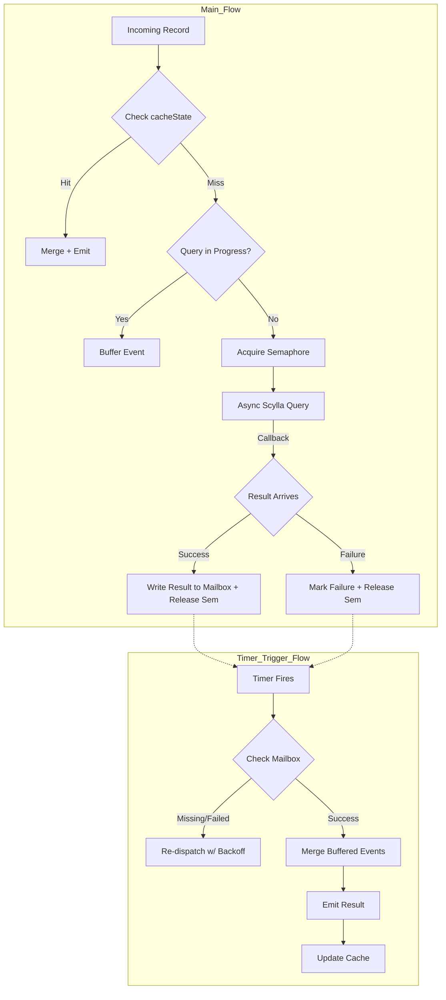

# Scaling Beyond Async I/O: Achieving High Throughput Per-Key Consistency in Flink Enrichment

---

## 1. Overview

In this blog, I will share my work on the evolution of the DB enrichment step in one of the projects that I worked. We had a step in our Flink pipeline, which involved looking at the current entry for a given key, enriching it with a new event, and writing it back. I will highlight how the design matured to handle significantly larger data volumes and stronger consistency requirements.

The enrichment component went through three distinct stages:

* **Global Synchronous Operator**
* **Pure Async IO**
* **Custom Async Implementation with State Management**

Each stage addressed a specific issue observed in the previous version, evolving from simple throughput improvements to sophisticated stateful coordination.

---

## 2. Motivation & High-Level Evolution of Design

Our pipeline which aggregated data from multiple sources in the final DB and Iceberg, needed to look at the current state for a given key from the DB, update it based on incoming events, and write it back.

### 2.1 Global Synchronous Operator

The initial POC version used a single global operator that synchronously read the current state from ScyllaDB, enriched the record based on the incoming event, and wrote it back.

**Pros**

* Simple and reliable.

**Cons**

* Poor throughput. Because the DB read was a blocking operation, the pipeline could handle roughly **150K records per hour**, leaving most Flink resources underutilized.

**Scaling Issues**

* To achieve the required multi-million-records-per-minute scale, parallelism would need to increase by **100x–200x**.
* This would massively increase CPU/memory utilization and open too many connections to ScyllaDB, making the design inefficient.

---

### 2.2 Asynchronous Enrichment using Flink’s Async I/O

To address throughput limitations, we moved to Flink’s `RichAsyncFunction`, allowing database calls to be executed asynchronously.

**Mechanism**

* Each record triggered a non-blocking query, and the callback merged the result once it became available.

**Pros**

* Massive horizontal scalability.
* Processed **hundreds of millions of records per hour** with near-full utilization.

**Cons**

* Consistency issues.
* With high throughput, if multiple events with the same primary key arrive, updates might be lost because reads for later events may occur before the write for a previous event has completed.

---

### 2.3 Custom Asynchronous Implementation with State Management

To combine the throughput benefits of async I/O with the consistency guarantees of stateful processing, we developed a custom asynchronous operator based on `KeyedProcessFunction`.

Each key behaves as a mini state machine that manages:

* **Per-key serialization**: Ensures only one async query for a key is active at any time.
* **Event buffering**: Additional events arriving for the same key are queued and merged once enrichment completes.
* **State caching**: Recently enriched values are stored in Flink state to avoid repeated DB lookups.
* **Retry with exponential backoff**: Transient Scylla errors are retried automatically.
* **Bounded concurrency**: A semaphore limits the number of concurrent Scylla queries per subtask, providing natural backpressure.

---

## 3. Implementation Approaches Considered

To achieve high throughput while keeping it consistent, we considered several approaches.

### A. Mini Batching before Enrichment

**Concept**

* Batch events arriving within a window and perform merges for events with the same primary key.

**Verdict**

* Reduces the probability of consistency issues but does not eliminate them.
* Events for the same key can still be split across consecutive batches, especially with highly variable traffic.

---

### B. Block Subsequent Events (KeyedOperator split by PK)

**Concept**

* Move the query part to an async callback.
* If another event with the same PK is in progress, buffer it and set a timer.

**Verdict**

* Efficient in theory, but Flink does not allow emitting directly from inside an async callback, making this approach difficult to implement cleanly.

---

### C. Buffer & Timer-Based Emit (Chosen Approach)

**Concept**

* Keep events in a buffer, fire an asynchronous query, and set up a timer.
* The async callback updates state tracking the DB response.
* The timer triggers the merge and emit logic.

**Implementation Notes**

* Uses the **Mailbox Handoff Pattern** to communicate between the DB IO thread and the Flink thread.
* Prevents data races and enables proper throttling.

---

## 4. Architecture Overview

The new operator is implemented as a `KeyedProcessFunction`, where each key acts as an isolated mailbox maintaining its own state, timers, and coordination logic.

### High-Level Flow

This design provides bounded concurrency, consistent enrichment for identical keys, and natural backpressure driven by Scylla capacity.

---

## 5. Concurrency and Backpressure

One major issue with the standard Async Operator was request throttling.

**Problem**

* Flink moves to the next event immediately after firing an async query or timer.
* This can overload the DB, causing request failures rather than backpressure.

**Solution**

* Use an in-memory semaphore configured to the desired concurrency per operator.

**Mechanism**

* Every DB request must acquire a permit.
* If no permits are available, the operator blocks processing of subsequent events, naturally propagating backpressure upstream.

---

## 6. State Design

| State                  | Type                        | Purpose                                      | Retention               |
| ---------------------- | --------------------------- | -------------------------------------------- | ----------------------- |
| `cacheState`           | `ValueState<GenericRecord>` | Caches enriched data for hot keys            | Flink managed, TTL 120s |
| `eventBuffer`          | `ListState<GenericRecord>`  | Buffers records while query is active        | Flink managed, TTL 120s |
| `isLoading`            | `ValueState<Boolean>`       | Marks if a query is currently running        | Flink managed, TTL 120s |
| `activeTimerTimestamp` | `ValueState<Long>`          | Tracks the latest registered timer           | Flink managed, TTL 120s |
| `asyncResultState`     | In-memory cache             | Temporary mailbox for async callback results | 60s expiry              |
| `currentAttempt`       | In-memory cache             | Retry counter, discards stale results        | 60s expiry              |

> **Note:** Only managed Flink state is checkpointed. In-memory caches are transient and repopulated after restart.

---

## 7. Retry and Backoff Strategy

* **Strategy**: Exponential backoff
  *(200ms → 400ms → 800ms → 1600ms → 3200ms → 5000ms, capped)*

* **Logic**

  * Each failure increments a retry counter.
  * A new timer is scheduled.
  * The query is reissued.

* **Sequence Safety**

  * Out-of-sequence async callbacks are ignored using per-key sequence numbers.

* **Max Retries**

  * If retries exceed the limit, the key is logged and the operator fails.
  * This triggers a restart from the last checkpoint.
  * DLQ support is planned for future iterations.

---

## 8. Timer and Recovery Semantics

Processing-time timers are used for mailbox processing and retry scheduling.

**Post-Restart Behavior**

* If the timer’s target time has passed, Flink fires it immediately.
* If recovery occurs before the target, the timer fires at the scheduled time.
* Timers created after the last checkpoint are not restored.

**Guarantee**

* No key remains stuck, even under partial recovery scenarios.

---

## 9. Per-Key Consistency

* **Serialization**: Only one async query runs per key (`isLoading` guard).
* **Buffering**: Concurrent events are buffered and merged after the async result arrives.
* **Caching**: Reuses recent enrichments to minimize redundant DB reads.
* **Write Order**: Enriched results are emitted and written back deterministically.

---

## 10. Comparison Across Versions

| Aspect         | Global Operator           | Async I/O             | Custom Implementation  |
| -------------- | ------------------------- | --------------------- | ---------------------- |
| Concurrency    | Single-threaded           | Bounded via config    | Bounded via semaphore  |
| Scalability    | Very limited              | Horizontally scalable | Horizontally scalable  |
| Consistency    | Low risk (low throughput) | Weak for same key     | Deterministic per key  |
| Retry Handling | Manual                    | Custom needed         | Built-in               |
| Caching        | Manual                    | None                  | TTL-managed state      |
| Backpressure   | Implicit                  | Implicit              | Explicit via semaphore |

---

## 11. Failure and Recovery

| Component               | Post-Restart Behavior        |
| ----------------------- | ---------------------------- |
| Managed state           | Restored from checkpoint     |
| Processing-time timers  | Fired immediately if overdue |
| Async caches            | Reinitialized on next retry  |
| In-flight async queries | Lost and retried             |
| Overall semantics       | **At-least-once preserved**  |

---

## 12. Trade-offs

| Benefit                           | Trade-off                              |
| --------------------------------- | -------------------------------------- |
| Predictable load on Scylla        | Increased average latency              |
| Deterministic per-key consistency | Higher operator complexity             |
| Reduced redundant reads (caching) | Additional state memory                |
| Automatic retries                 | Non-deterministic timers after restart |

---

## 13. Observed and Expected Improvements

| Version               | Scale                       | Key Outcome                         |
| --------------------- | --------------------------- | ----------------------------------- |
| Global Operator       | ~150K/hour                  |     Functional baseline             |
| Async I/O             | >100M/hour                  |     High throughput, weak consistency   |
| Custom Implementation | ~76% of Pure Async          |     Fully consistent with at-least-once guarantee |

---

## 14. Summary

The newer design introduces predictable concurrency, per-key consistency, and built-in fault tolerance. While it requires more replicas to reach the same throughput (roughly **76% efficiency** of pure async), it ensures correctness for read–modify–write flows critical for downstream consistency in **ScyllaDB** and **Iceberg**.
