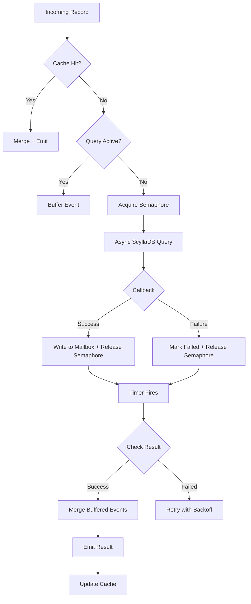

# Scaling Beyond Async I/O: Achieving High Throughput Per-Key Consistency in Flink Enrichment

## 1. Overview

In this post, I will share my work on how I evolved the database enrichment step in our Flink pipeline to handle significantly larger data volumes while maintaining strong consistency guarantees. Our enrichment component performs a classic read-modify-write pattern: fetch the current state for a key from Database, merge it with incoming events, and write it back.

The journey took us through three distinct architectural stages:

1. **Global Synchronous Operator** – Simple but slow
2. **Pure Async I/O** – Fast but inconsistent
3. **Custom Async Implementation with State Management** – Fast and consistent

Each evolution addressed critical limitations discovered in production, progressing from basic throughput improvements to sophisticated stateful coordination that ensures data correctness at scale.

---

## 2. The Journey: From Simple to Scalable

### 2.1 Starting Point: Global Synchronous Operator

Our initial proof-of-concept used a straightforward approach: a single global operator that synchronously read from ScyllaDB, enriched the record, and wrote it back.

**The Good**
- Simple to implement and reason about
- Reliable and correct

**The Problem**
- Abysmal throughput: approximately **150K records per hour**
- Blocking database calls left Flink resources idle
- Most CPU and memory sat unused while waiting for I/O

**Why This Couldn't Scale**

To reach our target of millions of records per minute, we would have needed to increase parallelism by 100-200x. This would have:
- Created an unsustainable number of ScyllaDB connections
- Massively inflated CPU and memory costs
- Still underutilized resources due to I/O blocking

The synchronous approach simply wasn't viable for production scale.

---

### 2.2 First Evolution: Asynchronous Enrichment with Flink's Async I/O

To break through the throughput ceiling, we adopted Flink's `RichAsyncFunction`, enabling non-blocking database operations.

**How It Works**

Each incoming record triggers an asynchronous ScyllaDB query. While waiting for the response, Flink processes other records, maximizing resource utilization. When results arrive via callback, they're merged with the original record and emitted downstream.

**The Transformation**
- Throughput skyrocketed to **hundreds of millions of records per hour**
- Near-complete CPU and memory utilization
- Excellent horizontal scalability

**The Hidden Cost: Lost Updates**

Under high load, a critical flaw could potentially occur. When multiple events for the same key arrived in quick succession:

1. Event A triggers a read at T0
2. Event B arrives and triggers another read at T1 (before A's write completes)
3. Both reads fetch the same stale state
4. Both updates write back, with the second overwriting the first
5. **Event A's changes are lost**

This race condition could potentially occur, making the solution unsuitable for use cases requiring strong per-key consistency.

---

### 2.3 Final Design: Custom Async with Per-Key State Machines

To preserve the throughput benefits of async I/O while guaranteeing consistency, we built a custom operator using `KeyedProcessFunction`. Each key operates as an independent state machine that coordinates asynchronous operations.

**Core Capabilities**

- **Per-key serialization**: Only one async query runs per key at any time
- **Event buffering**: Concurrent events for the same key are queued and merged later
- **State caching**: Recent enrichments are stored in Flink state to skip redundant lookups
- **Intelligent retry**: Transient failures trigger exponential backoff up to a configured limit
- **Backpressure control**: A semaphore caps concurrent ScyllaDB queries, preventing overload

**The Result**

We achieved approximately **76% of pure async throughput** while guaranteeing per-key consistency and at-least-once processing semantics. For our use case—where correctness is paramount—this trade-off was worth it.

---

## 3. Design Alternatives We Considered

### A. Mini-Batching Before Enrichment

**Concept**: Buffer events in small time windows and deduplicate events with the same key before enrichment.

**Why We Rejected It**

While this reduces collision probability, it doesn't eliminate it. Events for the same key can still span batch boundaries, especially under variable traffic patterns. We needed deterministic guarantees, not probabilistic improvements.

---

### B. Blocking Subsequent Events (Key-Partitioned Async)

**Concept**: Use async callbacks for queries, but block processing of subsequent events with the same key until the current operation completes.

**The Challenge**

Flink's threading model doesn't allow emitting records directly from async callbacks. The callback runs on a different thread than the main processing thread, making it difficult to implement this pattern cleanly without complex synchronization.

---

### C. Buffer & Timer-Based Emit (Our Choice)

**Concept**: Combine event buffering with Flink's timer mechanism to coordinate between async callbacks and the main processing thread.

**How It Works**

1. Buffer incoming events in Flink state
2. Fire an async query and register a processing-time timer
3. The async callback writes results to a thread-safe "mailbox" (Caffeine cache)
4. When the timer fires, the main thread reads from the mailbox, merges buffered events, and emits

**Why This Works**

The mailbox pattern safely bridges the gap between the async I/O thread and Flink's processing thread, enabling proper coordination without violating Flink's threading constraints.

---

## 4. Architecture Deep Dive

Our implementation uses `KeyedProcessFunction`, where each key maintains its own isolated state and coordination logic.

### Processing Flow

This design provides:
- **Bounded concurrency** via semaphore-based admission control
- **Consistent enrichment** through per-key serialization
- **Natural backpressure** when ScyllaDB is at capacity

---

## 5. Backpressure and Concurrency Control

One major flaw in standard async operators is the lack of built-in throttling.

**The Problem**

Flink eagerly processes records, firing async queries as fast as possible. Under high load, this can overwhelm the database, causing:
- Query timeouts and failures
- Cascading retries that worsen the problem
- No natural backpressure to slow down upstream

**Our Solution: Semaphore-Based Admission Control**

Each operator instance maintains an in-memory semaphore configured with `MAX_CONCURRENT_REQUESTS` (default: 100).

**How It Works**

1. Before firing a ScyllaDB query, the operator must acquire a permit
2. If no permits are available, processing blocks
3. Flink's backpressure mechanism kicks in, slowing upstream operators
4. When a query completes (success or failure), the permit is released
5. The next waiting record can proceed

This creates a self-regulating system that adapts to ScyllaDB's actual capacity.

---

## 6. State Management

Our operator maintains several types of state to coordinate asynchronous operations:

| State | Type | Purpose | Lifecycle |
|-------|------|---------|-----------|
| `cacheState` | `ValueState<GenericRecord>` | Caches recently enriched data | Checkpointed, TTL 120s |
| `eventBuffer` | `ListState<GenericRecord>` | Queues events during active query | Checkpointed, TTL 120s |
| `isLoading` | `ValueState<Boolean>` | Tracks if query is in progress | Checkpointed, TTL 120s |
| `activeTimerTimestamp` | `ValueState<Long>` | Tracks registered timer timestamp | Checkpointed, TTL 120s |
| `asyncResultState` | In-memory cache | Mailbox for async results | Not checkpointed, 120s expiry |
| `currentAttempt` | In-memory cache | Retry counter & sequence tracker | Not checkpointed, 120s expiry |

**Key Design Decisions**

- **Checkpointed state** is restored after failures, preserving consistency
- **In-memory caches** are rebuilt on restart, trading durability for performance
- **TTL (120s)** prevents unbounded state growth for abandoned keys
- **Sequence numbers** prevent out-of-order async results from corrupting state

---

## 7. Fault Tolerance: Retries and Recovery

### Retry Strategy

**Exponential Backoff**: 1000ms → 2000ms → 4000ms → 5000ms (capped)

**Sequence Tracking**: Each retry increments a sequence number. Late-arriving callbacks from earlier attempts are ignored.

**Max Retries**: After 6 failed attempts, the operator fails and restarts from the last checkpoint.

**Future Enhancement**: We plan to add a Dead Letter Queue (DLQ) for permanently failed records instead of failing the entire operator.

### Processing-Time Timer Semantics

Timers are used for both mailbox processing and retry scheduling.

**After Checkpoint Recovery**
- If the timer's target time has passed, Flink fires it immediately
- If the target time is in the future, the timer fires at the scheduled time
- Timers created after the last checkpoint are not restored

**Guarantee**: No key gets permanently stuck, even if recovery occurs mid-processing.

---

## 8. Ensuring Per-Key Consistency

Our design guarantees that events for the same key are processed in a deterministic order:

1. **Serialization**: The `isLoading` flag ensures only one query runs per key
2. **Buffering**: Concurrent arrivals are queued in `eventBuffer`
3. **Atomic Merge**: All buffered events are merged in a single timer callback
4. **Caching**: Recent results are reused, avoiding redundant queries
5. **Deterministic Emit**: Enriched records are emitted in a predictable order

**Result**: Even under high concurrency, we maintain read-modify-write consistency for each key.

---

## 9. Performance Comparison

| Aspect | Global Operator | Pure Async I/O | Custom Async + State |
|--------|----------------|----------------|---------------------|
| **Throughput** | ~150K/hour | >100M/hour | ~76M/hour |
| **Concurrency** | Single-threaded | Unbounded (config) | Bounded (semaphore) |
| **Scalability** | Very limited | Horizontal | Horizontal |
| **Per-Key Consistency** | Strong | Weak | Strong |
| **Retry Handling** | Manual | Custom needed | Built-in |
| **Caching** | None | None | TTL-based state |
| **Backpressure** | Implicit | None | Explicit |

**Key Takeaway**: We traded 24% of throughput for deterministic consistency—a worthwhile exchange for our use case.

---

## 10. Failure Scenarios and Recovery

| Component | Behavior After Restart |
|-----------|----------------------|
| Checkpointed state | Fully restored |
| Processing-time timers | Fire immediately if overdue |
| In-memory caches | Reinitialized empty |
| In-flight async queries | Lost; retried when timer fires |
| **Overall semantics** | **At-least-once delivery** |

**Note**: In-memory caches (`asyncResultState`, `currentAttempt`) are not checkpointed. On restart, these are empty, and the next retry cycle rebuilds them.

---

## 11. Trade-offs and Considerations

| Benefit | Cost |
|---------|------|
| Predictable ScyllaDB load | Increased average latency per record |
| Deterministic per-key consistency | Higher operator complexity |
| Reduced redundant reads (caching) | Additional state memory overhead |
| Automatic retry with backoff | Processing-time timers (not event-time) |
| Natural backpressure | Requires careful semaphore tuning |

---

## 12. Results and Impact

| Version | Throughput | Consistency | Key Outcome |
|---------|-----------|-------------|-------------|
| Global Operator | ~150K/hour | Weak but could be solved easily | Functional baseline, not production-ready |
| Synchronous Operator | ~3M/hour (depending on parallelism of operator) | Weak but could be solved easily | Functional baseline, not production-ready |
| Pure Async I/O | >100M/hour | Weak | High throughput, potential data loss under low cardinality load |
| Custom Async + State | >100M/hour (more resources required) | Strong | Production-ready: fast AND correct |

**Production Impact**

The custom implementation processes tens of millions of records per hour while maintaining:
- **Zero lost updates** for concurrent events
- **Graceful degradation** under ScyllaDB backpressure
- **Automatic recovery** from transient failures
- **Predictable resource usage** across the pipeline

---

## 13. Lessons Learned

1. **Async I/O isn't always the answer**: Raw throughput doesn't matter if your data is incorrect.

2. **State machines scale**: Per-key coordination can handle massive parallelism without global locks.

3. **Backpressure is critical**: Without admission control, async systems can death-spiral under load.

4. **The mailbox pattern works**: Bridging async callbacks to Flink's threading model requires careful coordination, but it's achievable.

5. **Trade-offs are worth it**: We happily sacrificed 24% throughput for correctness. The alternative—corrupted data in production—is unacceptable.

---

## 14. Conclusion

Building high-throughput, consistent data pipelines requires more than just async I/O. By combining Flink's stateful processing with careful concurrency control and the mailbox pattern, we achieved:

- **76% of pure async throughput** 
- **Deterministic per-key consistency** for read-modify-write operations
- **Predictable backpressure** that protects ScyllaDB from overload
- **At-least-once semantics** with automatic retry and recovery

For pipelines where correctness is non-negotiable—like ours feeding downstream analytics and compliance systems—this architecture strikes the right balance between performance and reliability.

The code is complex, but the guarantees are worth it. When data integrity matters, sometimes the right solution isn't the fastest one—it's the one that doesn't lose your data.

---

**Acknowledgments**: This work was built on the foundations of Flink's excellent stateful processing model and inspired by countless hours of debugging production incidents that taught us why consistency matters.